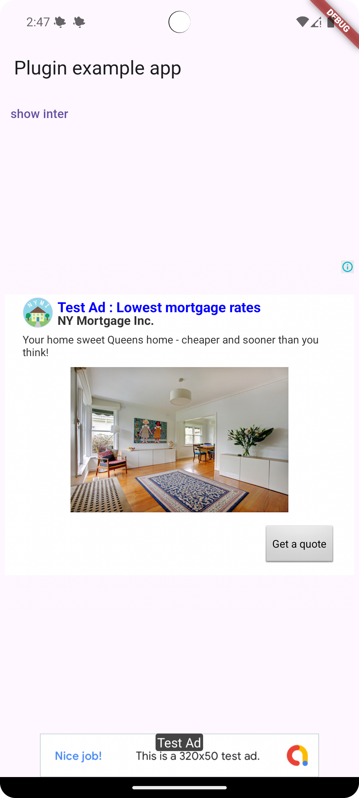

# infinity_ads_tracking_lib

A new Flutter plugin project.

## Getting Started

### android
```xml
<!-- your_plugin/android/src/main/AndroidManifest.xml -->
<manifest>

    <application>
        <!-- Add the Ad Manager App ID -->
        <meta-data
            android:name="com.google.android.gms.ads.APPLICATION_ID"
            android:value="ca-app-pub-xxxxxxxxxxxxxxxx~yyyyyyyyyy"/>
    </application>

</manifest>
```

### ios
```xml
<key>GADApplicationIdentifier</key>
<string>ca-app-pub-xxxxxxxxxxxxxxxx~yyyyyyyyyy</string>
```

### install dependency
```yaml
dependencies:
    infinity_ads_tracking_lib:
        path: # path to library
```

### example

- ad configurations
```dart
void main() {
  WidgetsFlutterBinding.ensureInitialized();
  AdManager.instance.initialize(configurations: [
    AdConfiguration(
      id: 'ca-app-pub-3940256099942544/6300978111',
      name: 'banner_ad_integration',
      type: AdType.banner,
      preload: 1,
    ),
    AdConfiguration(
      id: 'ca-app-pub-3940256099942544/1033173712',
      name: 'interstitial_ad_integration',
      type: AdType.interstitial,
      preload: 1,
    ),
    AdConfiguration(
      id: '/21775744923/example/native',
      name: 'native_ad_integration',
      type: AdType.native,
      preload: 1,
    ),
  ]);
  runApp(const MyApp());
}
```

- show interstitial ads
```dart
AdManager.instance.showInterstitialAd("interstitial_ad_integration");
```

- banner widget
```dart
BannerAdWidget(adName: "banner_ad_integration")
```

- native ads
```dart
NativeAdWidget(adName: "native_ad_integration")
```



see more at [](example/)